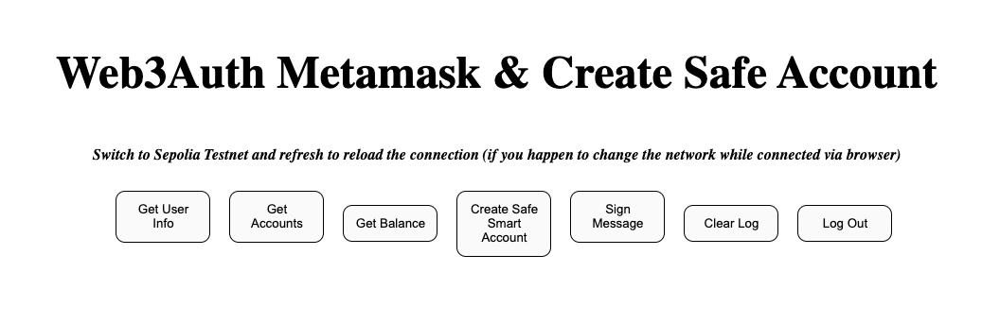

# Safe Deployer

Welcome to the Safe Deployer project! This application allows you to create a Safe smart account and submit it on chain. You can add 2nd ownership by adding another wallet addresses as owners for the Safe smart account. 

On NextJS v14, safe-core-sdk

## Features

- Deploy Safe smart accounts with multiple owners
- Easily add additional wallet addresses
- Predict Safe addresses before deployment

## Hosted Application

You can access the hosted application at: [Safe Smart Account Deployer](https://w3a-safe-deployer.vercel.app/)


## Usage
- Open the hosted application.
- Click on the "Create Safe Smart account" button.
- Enter the second wallet address in the pop-up modal.
- Submit the form to create the Safe transaction.

## Getting Started

Follow these instructions to get a copy of the project up and running on your local machine for development and testing purposes.

### Prerequisites

- Node.js
- npm or yarn

### Installation

1. Clone the repository:
   ```bash
   git clone https://github.com/MrMarciaOng/w3a-safe-deployer.git
   cd safe-deployer


### Install the dependencies:
```

npm install
or
yarn install

```

### Run app
```
npm run dev
or
yarn dev

```

